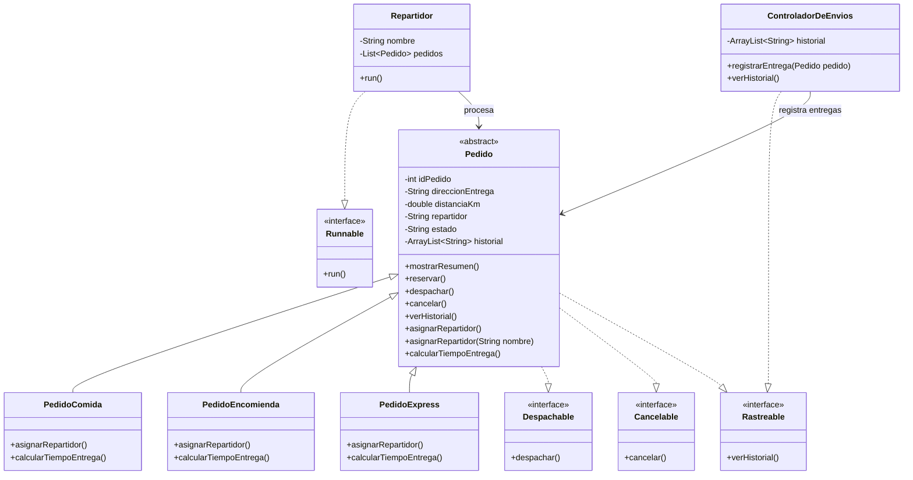

# SpeedFast

## Descripción

Proyecto desarrollado para las actividades de Desarrollo Orientado a Objetos II.

SpeedFast es un sistema de reparto a domicilio desarrollado en Java que permite representar y gestionar distintos tipos de pedidos utilizando Programación Orientada a Objetos.

Durante la Semana 4 el proyecto integra los contenidos trabajados anteriormente e incorpora programación concurrente para simular cómo varios repartidores realizan entregas al mismo tiempo.

El sistema considera tres tipos de pedidos:

- Pedido de comida.
- Pedido de encomienda.
- Pedido express.

Cada tipo de pedido posee una lógica diferente para la asignación de repartidores y el cálculo del tiempo estimado de entrega.

## Conceptos aplicados

- Programación Orientada a Objetos.
- Encapsulamiento.
- Herencia.
- Polimorfismo.
- Sobrecarga de métodos.
- Sobrescritura de métodos.
- Clases abstractas.
- Métodos abstractos.
- Interfaces.
- Colecciones `ArrayList`.
- Interfaz `Runnable`.
- Programación concurrente.
- `Thread.sleep()`.
- `ExecutorService`.
- Manejo de excepciones.
- Reutilización de código.
- Separación de responsabilidades.

## Estructura del proyecto

- `Pedido.java`: clase abstracta que contiene los atributos y comportamientos comunes de todos los pedidos y administra el historial individual.
- `PedidoComida.java`: representa pedidos de comida.
- `PedidoEncomienda.java`: representa pedidos de encomiendas.
- `PedidoExpress.java`: representa pedidos express.
- `Despachable.java`: interfaz que define la operación `despachar()`.
- `Cancelable.java`: interfaz que define la operación `cancelar()`.
- `Rastreable.java`: interfaz que define la operación `verHistorial()`.
- `ControladorDeEnvios.java`: administra y muestra el historial general de entregas.
- `Repartidor.java`: representa un repartidor, contiene una lista de pedidos e implementa `Runnable` para procesar las entregas.
- `Main.java`: realiza la simulación concurrente del sistema.

## Clase abstracta Pedido

La clase `Pedido` funciona como clase base de la jerarquía.

Contiene los atributos comunes:

- `idPedido`
- `direccionEntrega`
- `distanciaKm`
- `repartidor`
- `estado`
- `historial`

Además, contiene comportamientos reutilizados por los distintos tipos de pedido, como:

- `mostrarResumen()`
- `reservar()`
- `despachar()`
- `cancelar()`
- `verHistorial()`
- `asignarRepartidor(String nombre)`

También declara los métodos abstractos:

- `asignarRepartidor()`
- `calcularTiempoEntrega()`

Estos métodos son implementados de manera diferente por las subclases.

## Polimorfismo

### Sobrescritura

Las clases:

- `PedidoComida`
- `PedidoEncomienda`
- `PedidoExpress`

sobrescriben el método:

`asignarRepartidor()`

permitiendo realizar una asignación automática diferente según el tipo de pedido.

También sobrescriben:

`calcularTiempoEntrega()`

para calcular el tiempo estimado según las características de cada tipo de entrega.

### Sobrecarga

La clase `Pedido` posee una segunda versión del método:

`asignarRepartidor(String nombre)`

Esta versión permite asignar manualmente un repartidor indicando su nombre.

De esta forma, el sistema permite utilizar asignación automática o manual.

## Cálculo de tiempos

### Pedido de comida

El tiempo se calcula utilizando:

`15 minutos + 2 minutos por kilómetro`

### Pedido de encomienda

El tiempo se calcula utilizando:

`20 minutos + 1.5 minutos por kilómetro`

El resultado se convierte a un valor entero.

### Pedido express

El tiempo base es:

`10 minutos`

Si la distancia supera los 5 kilómetros se agregan:

`5 minutos adicionales`

## Interfaces

El sistema utiliza tres interfaces para separar responsabilidades.

### Despachable

Define:

`despachar()`

La clase `Pedido` implementa esta interfaz y las clases `PedidoComida`, `PedidoEncomienda` y `PedidoExpress` heredan esta funcionalidad.

Permite cambiar el estado de un pedido a despachado y registrar dicha acción en su historial.

### Cancelable

Define:

`cancelar()`

La clase `Pedido` implementa esta interfaz y sus subclases heredan esta funcionalidad.

Permite cancelar un pedido y registrar la cancelación en su historial individual.

### Rastreable

Define:

`verHistorial()`

Esta interfaz es utilizada por:

- `Pedido`, para mostrar el historial individual de cada pedido.
- `ControladorDeEnvios`, para mostrar el historial general de las entregas realizadas.

De esta forma, la misma interfaz posee una aplicación diferente según la responsabilidad de cada clase.

## Historial individual de pedidos

Cada objeto `Pedido` mantiene su propio:

`ArrayList<String>`

Este historial registra acciones como:

- Creación del pedido.
- Reserva.
- Asignación de repartidor.
- Despacho.
- Cancelación.

El método:

`verHistorial()`

permite visualizar el seguimiento completo de cada pedido.

## Historial general de entregas

La clase `ControladorDeEnvios` también utiliza:

`ArrayList<String>`

para almacenar las entregas realizadas.

Cada registro guarda:

- Tipo de pedido.
- ID del pedido.
- Nombre del repartidor.

Los pedidos cancelados no se agregan al historial general de entregas realizadas.

## Programación concurrente

Durante la Semana 4 se incorporó la clase `Repartidor`, que implementa la interfaz `Runnable`.

Cada repartidor posee un nombre y una lista de pedidos asignados.

El método `run()` recorre los pedidos de forma secuencial y utiliza `Thread.sleep()` con tiempos aleatorios para simular el tiempo necesario para realizar cada entrega.

En la clase `Main` se utiliza `ExecutorService` con un pool de tres hilos para ejecutar a los tres repartidores de manera concurrente.

El programa espera a que todos los repartidores finalicen sus entregas antes de terminar.

También se utiliza manejo de `InterruptedException` para controlar posibles interrupciones durante la ejecución.

## Diagrama de clases

## Simulación realizada

La clase `Main` crea seis pedidos y tres repartidores.

### Repartidor Camila

- Pedido de comida #101.
- Pedido express #102.

### Repartidor Luis

- Pedido de encomienda #103.
- Pedido de comida #104.

### Repartidor Daniela

- Pedido express #105.
- Pedido de encomienda #106.

Cada repartidor procesa sus dos pedidos de forma secuencial.

Los tres repartidores se ejecutan de manera concurrente mediante `ExecutorService`, por lo que sus mensajes de avance pueden aparecer intercalados en consola.

Las entregas utilizan pausas aleatorias mediante `Thread.sleep()`.

Finalmente, el programa espera hasta que todos los repartidores hayan terminado sus entregas.

## Escalabilidad, reutilización y mantenibilidad

La utilización de una clase abstracta permite centralizar los atributos y comportamientos comunes de los pedidos, evitando repetir código en las subclases.

El polimorfismo permite trabajar con objetos de distintos tipos mediante referencias de la clase `Pedido`, mientras cada subclase mantiene su propio comportamiento.

Las interfaces permiten separar responsabilidades como despacho, cancelación y rastreo.

La incorporación de `Runnable` y `ExecutorService` permite ejecutar varios repartidores de manera concurrente sin modificar la estructura principal de los tipos de pedido.

Esta estructura facilita agregar nuevos tipos de pedidos, repartidores u otras funcionalidades sin modificar completamente las clases existentes, favoreciendo la escalabilidad y mantenibilidad del sistema.

## Ejecución

El proyecto fue desarrollado utilizando Java e IntelliJ IDEA.

Para ejecutarlo:

1. Abrir el proyecto SpeedFast.
2. Abrir `Main.java`.
3. Ejecutar el método `main`.
4. Revisar la ejecución concurrente de los repartidores en consola.

## Autor

Vicente Sanz